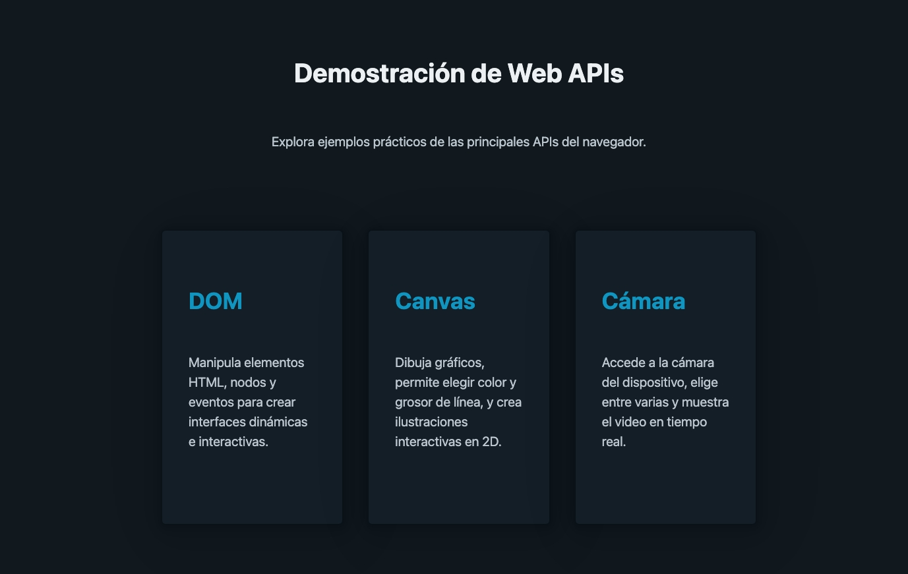

# 📌 Demostración de Web APIs

Explora ejemplos prácticos de las principales APIs del navegador: manipulación del DOM, canvas, cámara, almacenamiento, red, geolocalización, archivos, notificaciones, seguridad, multimedia, interfaz de usuario y más.

Proyecto basado en [HTML5](https://developer.mozilla.org/es/docs/Web/HTML), [CSS3](https://developer.mozilla.org/es/docs/Web/CSS) y [JavaScript](https://developer.mozilla.org/es/docs/Web/JavaScript). Utiliza [Pico.css](https://picocss.com/) para el diseño visual. No requiere backend ni instalación de dependencias.

## 🖼️ Vista Previa

| Inicio                     | Funcionalidad                   |
| -------------------------- | ------------------------------- |
|  |  |

> **Nota:** Agrega capturas de pantalla en `src/img/` con los nombres `main.png` y `feature.gif` para mostrar la vista previa.

## ⚙️ Requisitos

- Navegador web moderno (Chrome, Firefox, Edge, Safari)
- No requiere instalación de dependencias

## 🚀 Instalación

```bash
git clone https://github.com/brayandiazc/html-apis-examples.git
cd html-apis-examples
# Abre index.html en tu navegador
```

## 🧪 Tests

Actualmente este proyecto no incluye pruebas automatizadas ni linters, ya que es una colección de ejemplos front-end puros.

## 🔐 Acceso de Ejemplo

No aplica. Todas las funcionalidades son públicas y no requieren autenticación.

## 🛣️ Roadmap

- [ ] Ejemplos con APIs experimentales
- [ ] Mejorar la documentación de cada ejemplo
- [ ] Agregar más casos de uso interactivos

## 🗂️ Arquitectura de Carpetas

```
├── index.html
├── pages
│   ├── camera.html
│   ├── canvas.html
│   ├── device-info.html
│   ├── dom.html
│   ├── file.html
│   ├── geo.html
│   ├── image-canvas.html
│   ├── media-playback.html
│   ├── microphone.html
│   ├── network.html
│   ├── notifications.html
│   ├── other.html
│   ├── security.html
│   ├── storage.html
│   └── ui.html
└── src
    ├── css
    │   └── styles.css
    ├── img
    │   └── (agrega aquí tus imágenes de preview)
    └── js
        ├── camera.js
        ├── canvas.js
        ├── device-info.js
        ├── dom.js
        ├── file.js
        ├── geo.js
        ├── image-canvas.js
        ├── media-playback.js
        ├── microphone.js
        ├── network.js
        ├── notifications.js
        ├── other.js
        ├── security.js
        ├── storage.js
        └── ui.js
```

## 🖇️ Contribuye

```bash
# Fork → Crea rama → Cambios → Commit → Pull Request
```

¿Quieres mejorar algún ejemplo o agregar uno nuevo? ¡Los PRs son bienvenidos!

## 📄 Licencia

MIT — ver [LICENSE.md](LICENSE.md)

⌨️ con ❤️ por [Brayan Diaz C](https://github.com/brayandiazc)
