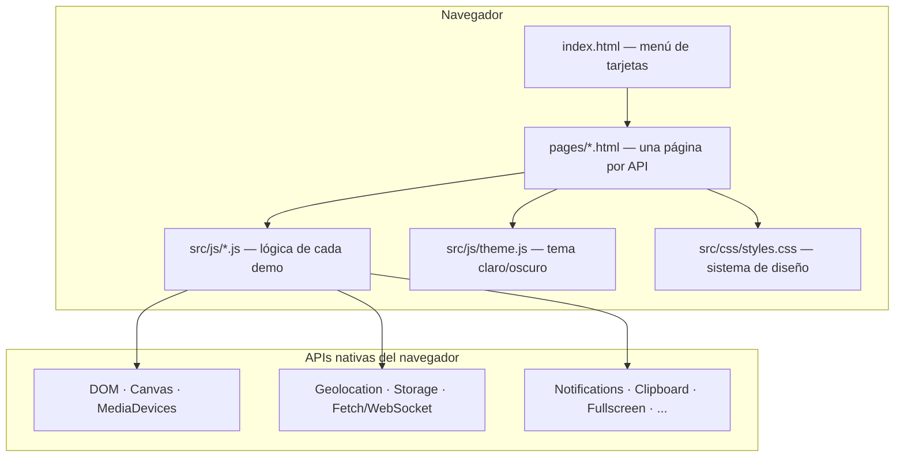
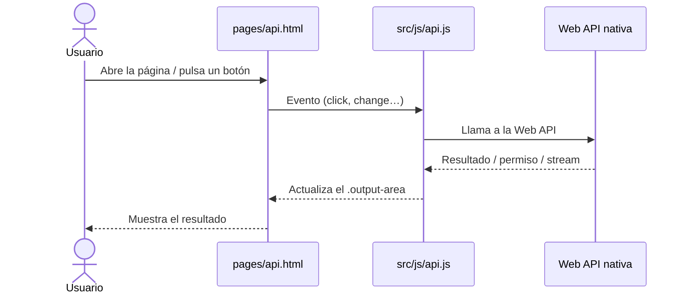

# Demostración de Web APIs — Arquitectura

> Vista de alto nivel de cómo está construido el sistema y cómo se reparten las
> responsabilidades. Para el stack real (versiones, librerías) ver
> [`stack.md`](stack.md). Para el propósito ver
> [`../product/business-model.md`](../product/business-model.md).
>
> **Última actualización**: 2026-07-02

## Panorama general

Es un **sitio estático multipágina** sin backend ni proceso de build. Cada ejemplo
es una página HTML autónoma que carga un script propio y ejecuta directamente en el
navegador contra las APIs nativas de la plataforma web. El navegador **es** el
runtime: no hay servidor de aplicación, base de datos ni API propia que mantener.

## Componentes

| Componente           | Responsabilidad                                             | Tecnología           |
| -------------------- | ---------------------------------------------------------- | -------------------- |
| `index.html`         | Portada: rejilla de tarjetas que enlaza a cada demo        | HTML + CSS           |
| `pages/<api>.html`   | Marcado de un ejemplo concreto de una Web API              | HTML                 |
| `src/js/<api>.js`    | Lógica del ejemplo: engancha eventos y llama a la Web API  | JavaScript (vanilla) |
| `src/js/theme.js`    | Alterna y persiste el tema (claro/oscuro) en `localStorage`| JavaScript (vanilla) |
| `src/css/styles.css` | Sistema de diseño único (tokens, temas, componentes)       | CSS                  |

## Decisiones clave

| Decisión                                    | Razón                                                              |
| ------------------------------------------- | ----------------------------------------------------------------- |
| Sin framework ni build                      | El foco es la API nativa; el código debe leerse sin abstracciones |
| Una página + un script por API              | Cada ejemplo es autocontenido y copiable de forma independiente   |
| CSS propio con design tokens (sin Pico.css) | Identidad visual coherente con brayandiazc.com y tema conmutable  |

> El detalle de la migración desde Pico.css se registra en el ADR
> [`0002-reemplazar-picocss-por-sistema-de-diseno.md`](../decisions/0002-reemplazar-picocss-por-sistema-de-diseno.md).

## Reglas no negociables

- **Cero dependencias en runtime**: nada de CDNs de framework ni paquetes npm en
  las páginas. La única carga externa admitida es la tipografía (Google Fonts).
- **Sin build**: abrir un `.html` en el navegador debe bastar para ver el ejemplo.
- **No romper los enganches del JS**: los `id`/clases que consultan los scripts son
  contrato; el marcado puede reestilizarse pero no renombrar esos ganchos.
- **Degradación elegante**: si una API no está disponible o el usuario deniega un
  permiso, el ejemplo lo comunica en pantalla, no falla en silencio.

## Flujo típico de un ejemplo

## Referencias

- [`stack.md`](stack.md) — stack tecnológico y versiones.
- [`design.md`](design.md) — sistema de diseño y UI.
- [`../conventions/`](../conventions/README.md) — convenciones de trabajo.
